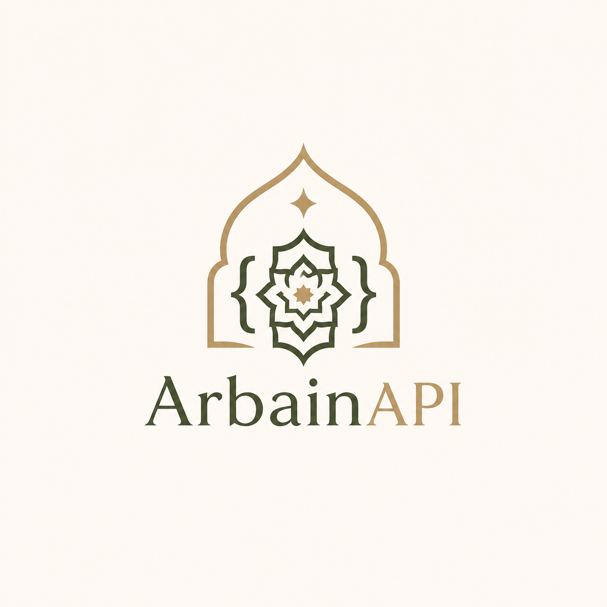

# 📖 Hadits Arbain API

---



---

> A RESTful API providing access to the complete Hadith Arbain An-Nawawi (42 Hadiths) in multiple languages — Arabic, English, and Indonesian.


---

## 🌐 Base URL

```
https://arbain-api.vercel.app/hadits
```

---

## 📡 Endpoints

### Get All Hadiths
```
GET /arbain
```
Returns all 42 hadiths.

**Response:**
```json
[
  {
    "id": 1,
    "number": 1,
    "title": { "in": "...", "ar": "...", "en": "..." },
    "riwayah": "Muttafaq 'Alayh",
    "text": { "ar": "...", "en": "...", "in": "..." }
  }
]
```

---

### Get Hadith by ID
```
GET /arbain/:id
```

**Example:** `GET /arbain/1`

**Response:**
```json
{
  "id": 1,
  "number": 1,
  "title": {
    "in": "Amalan Bergantung pada Niat",
    "ar": "إِنَّمَا الأَعْمَالُ بِالنِّيَّاتِ",
    "en": "Good Deeds Depend on Intentions"
  },
  "riwayah": "Muttafaq 'Alayh",
  "text": {
    "ar": "...",
    "en": "...",
    "in": "..."
  }
}
```

**Error (not found):**
```json
{ "message": "Hadits tidak ditemukan" }
```
---

## 📦 Response Format

| Field | Type | Description |
|---|---|---|
| `id` | number | Unique identifier |
| `number` | number | Hadith number in Arbain |
| `title.in` | string | Title in Indonesian |
| `title.ar` | string | Title in Arabic |
| `title.en` | string | Title in English |
| `riwayah` | string | Narrator of the hadith |
| `text.ar` | string | Full text in Arabic |
| `text.en` | string | Full text in English |
| `text.in` | string | Full text in Indonesian |

---

## 🛡️ Rate Limiting

To ensure fair usage, requests are limited to **100 requests per 15 minutes** per IP address.

If the limit is exceeded, the API returns:
```json
{ "message": "Too many requests, please try again later." }
```

---

## 🛠️ Tech Stack

- **Runtime**: Node.js
- **Framework**: Express.js
- **Security**: Helmet, CORS, express-rate-limit

---

## ⚙️ Installation

```bash
# Clone the repository
git clone https://github.com/yourusername/hadits-arbain-api.git

# Navigate to project directory
cd hadits-arbain-api

# Install dependencies
npm install

# Start the server
node index.js
```

Server will run on `http://localhost:8080`

---

## 📁 Project Structure

```
hadits-arbain-api/
├── data/
│   └── arbain.json       # 42 hadiths data
├── routes/
│   └── arbain.js         # Route handlers
├── index.js              # Entry point
└── package.json
```


## 📬 Contact

Feel free to open an issue if you find any bugs or have suggestions.

---

> *"Sesungguhnya amal itu tergantung pada niatnya."* — HR. Bukhari & Muslim
